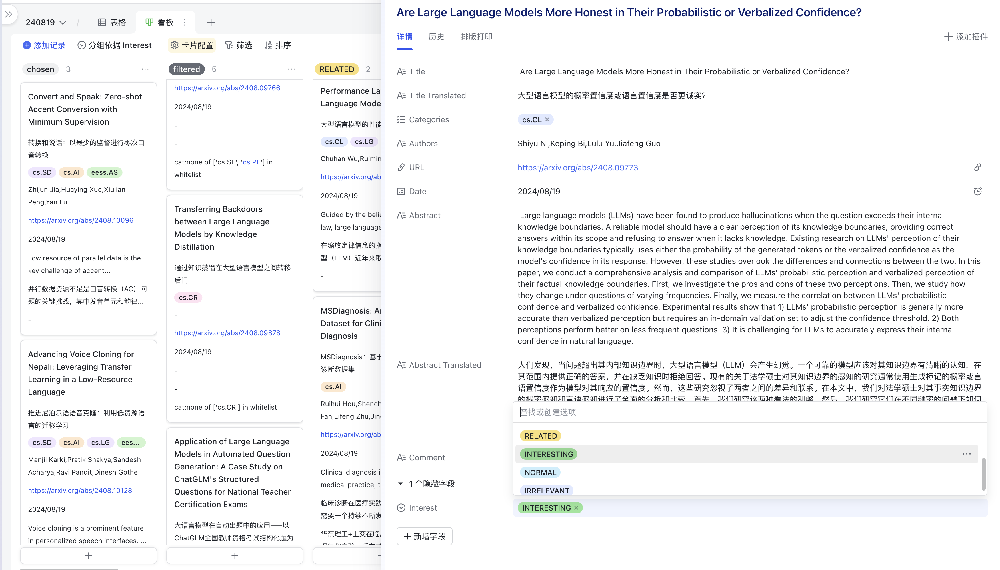
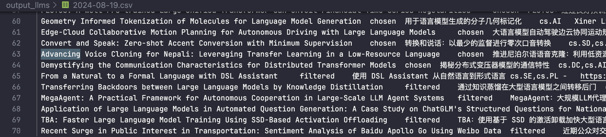
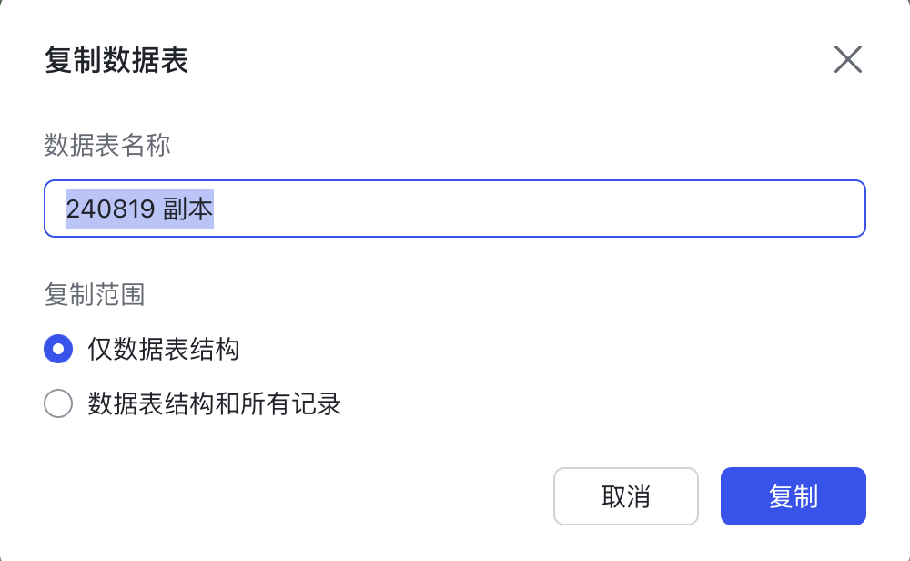

# ARXIV_CRAWLER

这是一个高效，快捷的 arXiv 论文爬虫，它可以将指定主题，包含指定关键词的论文信息爬取到本地，并且将其中的标题和摘要翻译成中文。

主要特点包括：

- 高速：通过进行异步网络请求，这个爬虫能够在两分钟之内爬取并翻译 2000 篇文章的标题和摘要信息，并且将其输出为精美的 markdown 文件（取决于您的网络带宽，在一个能高速链接arxiv和google的环境下只需要十几秒）。
- 完备：通过以**最新公布时间**为索引，这个爬虫可以做到按天为单位更新且无漏召，无重复。
- 增量更新：这个爬虫会维护一个本地数据库，每次爬取时只需要将新提交的文章插入到数据库中。但它也支持你补充过去某段时间的文章。
- 可视化：爬取的结果可以导出为csv文件，配合飞书实现的精美可视化界面更加方便阅读和筛选，详情见[配合飞书的进阶用法](#进阶用法-配合飞书使用)



下列示意中，系统用 4s 爬取并翻译了 2024 年 8 月 19 日的全部 70 篇文章，并根据其领域过滤了其中的 6 篇。并将结果输出到`output_llms/2024-08-19.md`中。


markdown 示意：

<div style="text-align: center;">
    
</div>

论文的数据将被持久化在一个本地数据库`papers.db`中，这是为了便于进行[基于公布时间的增量更新](#进阶用法-基于公布时间的增量更新)。

## 基本用法：爬取当天提交的论文为 markdown

1. 克隆本仓库到本地

```bash
git clone https://github.com/huiyeruzhou/arxiv_crawler.git
```

2. 安装依赖

```bash
pip install BeautifulSoup4
pip install rich
pip install aiohttp
pip install requests
```

3. 运行

- 建立基础数据库

```bash
python arxiv_crawler.py
```

这段代码会将最近**一个月**内大模型相关的论文信息爬取到本地的`papers.db`中，并且将最近**一天**内公布的文章输出为带有元信息的 markdown 文件。

- 增量更新

由于更新过程需要逐个检查论文是否已经存在，因此增量更新时不再使用异步爬取而是使用同步爬取，这会导致一定的速度下降，对于少量论文来说无所谓。如果很久没有更新，建议直接用`fetch_all`方法爬整月论文，这样更快。

增量更新的原理请见[进阶用法-基于公布时间的增量更新](#进阶用法-基于公布时间的增量更新)。

```py
from datetime import date, timedelta
from arxiv_crawler import ArxivScraper
today = date.today().strftime("%Y-%m-%d"),

scraper = ArxivScraper(
    date_from=today,
    date_until=today,
)
scraper.fetch_update()
scraper.to_markdown()
scraper.to_csv(csv_config=dict(delimiter="\t", header=False))
```

日常使用时只需要修改这部分代码中的内容即可。你可以将代码复制到`run.py`中，它不会被 git 跟踪。

- 从数据库中生成markdown/csv

```bash
python paper.py
```

这段代码会将`papers.db`中最近**一天**内提交的论文信息输出为 markdown 文件和 csv 文件，如果你只是需要重新获得已经爬取的论文中的信息，可以基于这里的代码修改。

1. 用法说明

- 要修改爬取的时间范围，领域，关键字，请参考`arxiv_crawler.py`中`ArxivScraper`类的注释：
  一个文件被爬取到的条件是：首次提交时间在`date_from`和`date_until`之间，并且包含至少一个关键词。
  一个文章被详细展示（不被过滤）的条件是：至少有一个领域在白名单中，并且没有任何一个领域在黑名单中。
  Args:

  - date_from (str): 开始日期(含当天)
  - date_until (str): 结束日期(含当天)
  - category_blacklist (list, optional): 黑名单. Defaults to [].
  - category_whitelist (list, optional): 白名单. Defaults to ["cs.CV", "cs.AI", "cs.LG", "cs.CL", "cs.IR", "cs.MA"].
  - optional_keywords (list, optional): 关键词, 各词之间关系为OR, 在标题/摘要中至少要出现一个关键词才会被爬取.
        Defaults to [ "LLM", "LLMs", "language model", "language models", "multimodal", "finetuning", "GPT"]
  - trans_to: 翻译的目标语言, 若设为可转换为False的值则不会翻译
  - proxy (str | None, optional): 用于翻译和爬取arxiv时要使用的代理, 通常是http://127.0.0.1:7890. Defaults to None

- 输出文件名是根据日期生成的，可以使用`output`方法的`filename_format`参数修改日期格式，默认为`%Y-%m-%d`即形如`2024-08-08.md`。

```py
scraper.to_markdown(filename_format='%Y-%m-%d')
```

- 如果你希望将一条元信息添加到输出文件中，可以使用`output`方法的`meta`参数。

```py
scraper.to_markdown(meta=True)
```

元信息形如：

> 本文由 [https://github.com/huiyeruzhou/arxiv_crawler](https://github.com/huiyeruzhou/arxiv_crawler) 自动生成
>
> 领域白名单: cs.CV;cs.AI;cs.LG;cs.CL;cs.IR
> 关键词： LLM, LLMs, language+model, language+models, multimodal, finetuning, GPT

## 结果示例

假设爬取了七天的论文，那么结果可能形如：

```bash
output_llms
├── 2024-08-08.md
├── 2024-08-09.md
├── 2024-08-10.md
├── 2024-08-11.md
├── 2024-08-12.md
├── 2024-08-13.md
└── 2024-08-14.md
```

其中被保留的内容形如：

```md
# 论文全览：2024-08-16

共有68篇相关领域论文, 另有4篇其他

## 人工智能(cs.AI:Artificial Intelligence)

###  A theory of understanding for artificial intelligence: composability, catalysts, and learning  
[[arxiv](https://arxiv.org/abs/2408.08463)] [[cool](https://papers.cool/arxiv/2408.08463)] [[pdf](https://arxiv.org/pdf/2408.08463)]
> **Authors**: Zijian Zhang,Sara Aronowitz,Alán Aspuru-Guzik
> **First submission**: 2024-08-15
> **First announcement**: 2024-08-16
> **comment**: 13 pages, 3 figures
- **标题**: 人工智能理解理论：可组合性、催化剂和学习
- **领域**: 人工智能
- **摘要**: 理解是人工智能（AI）中一个至关重要但又难以捉摸的概念。这项工作提出了一个基于可组合性概念的分析理解的框架。对于任何主体（例如，人或人工智能），我们建议从验证者的角度，根据其将相关输入处理（组合）为令人满意的输出的能力来描述其对对象的理解。这种高度通用的框架可以很容易地应用于非人类主体，例如人工智能、非人类动物和机构。此外，我们提出了分析输入的方法，以提高组合物的输出质量，我们称之为催化剂。我们展示了如何通过分析充当催化剂的成分来揭示主体的结构，并认为主体的学习能力可以被视为其将输入组合到其内部催化剂的能力。最后，我们研究了学习能力对于人工智能获得通用智能的重要性。我们的分析表明，能够生成可作为自身催化剂的输出的模型（例如语言模型）为克服人工智能理解中现有的局限性奠定了基础。

...(Some other content)
```

然后是被过滤掉的内容，会显示它被过滤的原因（命中了哪个黑名单领域/所有领域都不在白名单当中）

```md
- [ Automating Transparency Mechanisms in the Judicial System Using LLMs: Opportunities and Challenges ](https://arxiv.org/abs/2408.08477)
  - **标题**: 利用法学硕士实现司法系统透明度机制的自动化：机遇与挑战
  - **Filtered Reason**: none of cs.CY in whitelist
```

## 进阶用法-配合飞书使用

得益于飞书文档提供的[多维表格](https://www.feishu.cn/hc/zh-CN/category/6933474572494716956-%E5%A4%9A%E7%BB%B4%E8%A1%A8%E6%A0%BC)功能，我们可以将论文信息转换为看板视图，以获得极尽丝滑的体验：


文章的信息一览无余，我们还可以根据自己的兴趣对文章进行粗筛，然后阅读自己最感兴趣的文章，如此大大提升了我们的科研效率。

### 1.输出为 csv

下面这段代码将不会输出 markdown，而是输出一个 csv 文件。通过参数指定不输出表头，并且以制表符分隔，我们可以直接复制这个 csv 的内容到飞书云文档中。

```py
from arxiv_crawler import ArxivScraper
import asyncio
from datetime import date, timedelta

today = date.today().strftime("%Y-%m-%d")

scraper = ArxivScraper(
    date_from=today,
    date_until=today,
)
asyncio.run(scraper.fetch_all())
scraper.to_csv(csv_config=dict(delimiter="\t"), header=False)
```

### 2.建立飞书多维表格

可以使用这个[模板](https://sx43gev8evy.feishu.cn/wiki/YLM1weiT3iaDNqkwL3NcnAO0nUb?from=from_copylink)

表格视图就是我们 csv 文件的内容，其中 title 作为索引，interest 列是一个单选列，初始的 interest 只有两种，一种是 chosen，另一种是 filtered，分别对应于被保留和被过滤的文章。在阅读的过程中，可以根据自己的研究方向和兴趣进行筛选。categories 是文章在 arxiv 上的领域 tag，是一个多选列，飞书表格会自动将以逗号分隔的多选内容拆解开，实现自动识别。


切换到看板视图之后，就可以开始阅读和过滤文章了，这里我预设了 5 个等级的文章：

- CORE：表示 scaling law 这种经典文章，小同行的文章
- PEER：表示大同行的文章，相关领域的文章
- RELATED：表示相关领域的文章，或者相关内容的其他方法
- INTERESTING：和自己的科研领域方向较远，但比较有趣
- IRRELEVANT：比较 trival 的其他领域文章


### 3.复制 csv 内容

首先找到输出的文件，比如`output_llms/2024-08-19.csv`


接下来复制一份数据表，但是只复制其结构

<div style="display: flex; justify-content: space-between;">
    
    
</div>

在副本里插入新行，**至少有一行，且总行数少于记录条数即可！飞书会自动扩展不足的行数**。


然后`ctrl+a`全选再`ctrl+v`粘贴到表格中，接下来切换到看板视图开始阅读论文吧！

## 进阶用法-基于公布时间的增量更新

爬取论文的目的是为了获取第一手的学术视野，因漏召而错过好论文会带来很大的损失。为了避免漏召，我们可以加入大量关键词，以保证搜集全该领域的文章。

然而，还有一种情况是无法避免的：某论文于 A 日提交，但直到 A+x 日才被公开。由于 arxiv 中基于公开日期的搜索只支持**以月份为粒度**，因此我们无法精确的获得**某天公开**的所有论文。

### 增量内容的判断

虽然我们不能指定搜索某日更新的论文，不过我们可以爬取一整月的论文，然后将其按照**越新越前**的方式进行排序。第一次运行爬虫时，我们将所有文章加入数据库中。之后每次我们都从前往后将他们加入数据库，直到我们遇到已经存在于数据库中的论文。这就完成了所有增量内容的更新。

如果基于**首次提交日期**进行搜索，是无法做到这样的效果的，因为一篇文章可能在提交一年以后才被公开，没法进行定向检索。当然，如果一篇文章先公开，又在我们爬到它之前隐藏了怎么办？只能期待这种蛇皮文章应该不会太多。

### 公布时间的推断

上述方法虽然可以保证我们总是能爬取到最新的论文，但如果我们只按照论文首次提交日期索引，就没办法**读取**最新的论文。

例如8.19我们爬到了8.12，8.16，8.18的论文各一篇，我们要读这三篇文章就得重新导出这三天的论文列表。一种折衷方式是每次都把“当日之前提交，但在当天才公布”的论文打印出来作为补充列表。但这样也很麻烦。

于是，我们可以尝试“推断”论文的首次公布日期。虽然我们不知道公布时间，但结果是按照公布时间排序的，结合`首次提交日期<首次公布日期`以及`同一天公布的文章中，越早提交的文章越先公布`的条件，以及arxiv在周末和假日不公布论文，就可以用下列代码进行推断：

```py
from arxiv_time import next_arxiv_update_day, native_local_to_utc
    def process_papers(self):
        """
        推断文章的首次公布日期, 并将文章添加到数据库中
        """
        # 从下一个可能的公布日期开始
        announced_date = next_arxiv_update_day(self.fisrt_announced_date)   
        self.console.log(f"fisrt announced date: {announced_date.strftime('%Y-%m-%d')}")
        # 按照从前到后的时间顺序梳理文章
        for paper in reversed(self.papers):
            # 文章于T日美东时间14:00(T UTC+0 18:00)前提交，将于T日美东时间20:00(T+1 UTC+0 00:00)公布，T始终为工作日。
            # 因此可知美东 T日的文章至少在UTC+0 T+1日公布，如果超过14:00甚至会在UTC+0 T+2日公布
            next_possible_annouced_date = next_arxiv_update_day(paper.first_submitted_date + timedelta(days=1))
            if announced_date < next_possible_annouced_date:
                announced_date = next_possible_annouced_date
            paper.first_announced_date = announced_date
        self.paper_db.add_papers(self.papers)
```

同样的，我们也可以通过上一次更新数据库的时间来判断期间是否有arxiv更新：

```py
    # 上一次更新最新文章的UTC时间. 除了更新新文章外也可能重新爬取了老文章, 数据库只看最新文章的时间戳。
    self.search_from_date = self.paper_db.newest_update_time()
    # 检查一下上次之后的最近一个arxiv更新日期
    self.search_from_date = next_arxiv_update_day(self.search_from_date)
    # 如果还没到更新时间就不更新了
    if self.search_from_date >= datetime.now(UTC).replace(tzinfo=None):
        self.console.log(f"[bold red]Your database is already up to date.")
        return
```

```sql
SELECT MAX(update_time) as max_updated_time
FROM papers
WHERE first_announced_date = (SELECT MAX(first_announced_date) FROM papers)
```

### 每月首日的处理

上述方法看起来已经非常完善了，然而arxiv网站还存在一些比较尴尬的设定。在搜索系统中的“首次公布时间”，实际上是根据arxivid决定的，也就是说id越大，公布时间越晚，id开头的数字如2408就代表了公布的月份。

这本来没有什么问题，然而在每月的第一个公布日，例如2024年9月2日时，所公布的文章实际上都具有2408开头的id。因此，这些文章全部被错误的标记为“公布于上一个月”。通过OAI-PMH元数据可以查证这一点：

比如[2312.00001的元数据](https://export.arxiv.org/oai2?verb=GetRecord&identifier=oai:arXiv.org:2312.00001&metadataPrefix=arXiv)就显示，它实际上是公布于2023-12-04。而2024-12-01公布的文章，全部都被标记为2024年11月公布了。

为此，我们在推断更新时间和设置搜索时间时都要做相应处理：x月的文章的更新时间至少是x月的第二个公布日期.

对于全量更新，我们要正确设置公示日期，以便正确推断公示日期：

```python
# 由于arxiv的奇怪机制，每个月的第一天公布的文章总会被视作上个月的文章, 所以需要将月初文章的首次公布日期往后推一天
self.fisrt_announced_date = next_arxiv_update_day(next_arxiv_update_day(self.search_from_date) + timedelta(days=1))
```

对于增量更新，我们需要正确的将搜索日期上推一个月，公示日期不变：

```python
# 如果这一次的更新时间恰好是这个月的第一个更新日，那么当日更新的文章都会出现在上个月的搜索结果中
# 为了正确获得这天的文章，我们上推一个月的搜索时间
self.fisrt_announced_date = self.search_from_date
if self.search_from_date == next_arxiv_update_day(self.search_from_date.replace(day=1)):
    self.search_from_date = self.search_from_date - timedelta(days=31)
    self.console.log(f"[bold yellow]The update in {self.fisrt_announced_date.strftime('%Y-%m-%d')} can only be found in the previous month.")
else:
    self.console.log(
        f"[bold green]Searching from {self.search_from_date.strftime('%Y-%m-%d')} "
        f"to {self.search_until_date.strftime('%Y-%m-%d')}, fetch the first {self.step} papers..."
    )
```

## 相关技术

要爬取 arxiv，可用的方法至少有三种。

1. 使用 arxiv API。通过 pyarxiv 库，可以轻松地使用 arxiv API 来获取论文信息，并且可以精确的指定 subcategory。但是这种方式无法通过时间范围进行筛选。
2. 使用 arxiv 的 OAI-PMH 数据。arxivscraper 库使用这种方式进行爬取，但它返回的 xml 十分巨大，并且其时间是最后一次更新元数据的时间，而非初始提交时间。由于[一些特性](https://info.arxiv.org/help/oa/index.html)，甚至当作者完全没有更新过论文时，也会返回该论文。这会让我们看到很多过时的文章。
3. 基于 arxiv 网页。可选择的网页有许多，arxiv 的网页格式非常简单。为了提供精确的时间范围，我选择使用[https://arxiv.org/search/advanced](https://arxiv.org/search/advanced)，此外爬取[https://arxiv.org/list/cs/recent](https://arxiv.org/list/cs/recent)是一个不错的方式。

要进行 google 翻译，关键是要计算出正确的 token，参考了[zotero 翻译插件](https://github.com/windingwind/zotero-pdf-translate/blob/main/src/modules/services/google.ts)的代码。
